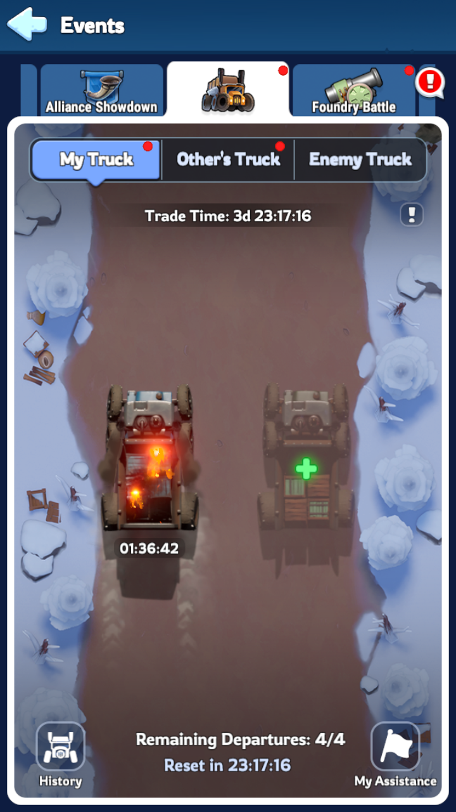
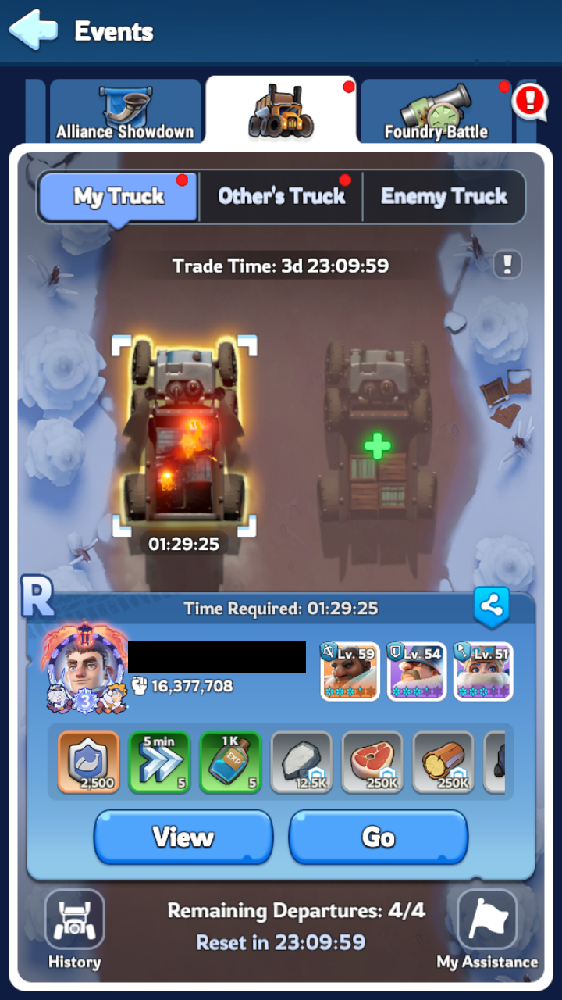
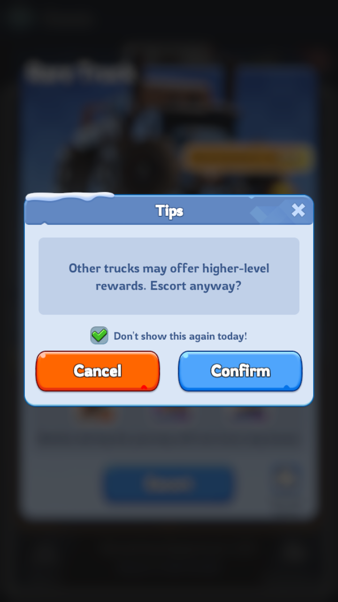

# Introduction 

Explain the expected tundra truck task execution.

Event possible state : {inactive, count down, active, ended}  
Activities : 
- manage my two trucks (left, right) 
- raid on trucks.
- Offer Escort to alliance players, ask for escort on a truck.

truck properties :
- truck possible states are : {available, departed, arrived, unavailable}
- truck possible qualities are : { "Normal", Common "N", rare "R", Super rare "SSR"}


The game rule : 

Player Sends the truck with the best possible quality to earn resources.
The truck quality is random, and you can refresh the truck quality a certain amount of time.
So the sequence is for the player : 
    - checken on left or right truck state
    - if available open the truck details window
        + Option to Refresh truck if needed (truck not ssr) for better truck quality. Freely or paid.
        + Option to be escorted (once a day)
        + Validate to send the truck with display disparted state.
    - if arrived collect them.
Inpendently the player can offer escort.

More details at this [wiki](https://www.whiteoutsurvival.wiki/events/tundra-trade-route/)

Captures :
The truck tab view : 

After left truck selected, right truck position has changed : 
 

Dialog asking to confirm a not SSR truck to send : 


# Task Pre-requesite

Must be on the world or home screen.  
if option activation time set up : check it otherwise postpone execution.

# Task Execution

Raid on trucks is not supported.
Escort feature is not supported.

```
Go to Tundra Truck Event screen through Menu
Check the event state (COUNTDOWN, ENDED, ACTIVE)
if ACTIVE
    check for arrived truck using OCR.
        collect any detected arrived truck.
    check for available truck using OCR (REMAINING_TRUCKS_OCR)
        if trucks are in transit reschedule task for when they come back 
    At least one truck availble, try so send them
        check left truck status
            taps on the truck to open the dialog box
            check for departed OCR (TUNDRA_TRUCK_ARRIVED)
            check for escort  OCR (TUNDRA_TRUCK_ESCORT)
        check right truck status 
            taps on the truck to open the dialog box
            check for departed OCR (TUNDRA_TRUCK_ARRIVED)
        if both trucks are departed
            reschedule task to execute sonnest (when a truck has arrived)
        send left truck
            taps on the truck to open the dialog box
            check for escort  OCR (TUNDRA_TRUCK_ESCORT)
            if SSR is required find it. cancel send truck if not possible.
            tap the escort button.
            if detect ""higher-level trucks" pop-up" OCR (TUNDRA_TRUCK_TIPS_POPUP)
                tap tips checkbox (dont show for today)
                tap confirm button.
        send right truck (as done for left truck)
```

How the SSR truck is searched : 
```
    detect SSR OCR (TUNDRA_TRUCK_YELLOW)
    if not found refresh :
        tap refresh button
        detect a free refresh OCR (TUNDRA_TRUCK_REFRESH)
        detect a gem refresh OCR (TUNDRA_TRUCK_REFRESH_GEMS)
        if free refresh available 
            tap confirm button (???)
            tap free refresh poibt
        if gem refresh available
            if option use gems confirm and tab
            else tap cancel popup and close truck windows
    repeat steps MAX_REFRESH_ATTEMPTS unless no free refresh or no gem refresh possible.           
```
Task settings : 
  - "Go Only for SSR trucks" : if not checked the task will not seek for better trucks, it direclty send
  - "Use gems for refresh" : if previous option is checked, it will spend gems until SSR truck is found (reminder : 6 refresh garantee to find an SSR)
  - Activation time : at wich time you want the task to start sending trucks.

# Task End

reschedule soonest to send a truck that has just arrived.

# Task Exit cases : 

Success - all trucks are either {departed, unavailable} after task exits.
Error - no truck found.

# Failure case not handled :

Zone to TAP are not all checked before tapping.

# Stat

No stat are displayed by now. this is WIP.

The task is performing well if before event reset remaining départures is 0 (4 trucks sent), unless the activation time does not allow it.
The task counts for each truck : 
- the number of trucks sent
- The number for a call to refresh
- the number of truck collect.

The stask is stateless so it cannot reset counts. Is is done by user.

# configuration : 

## View : 

TruckSSR (bool) : try to find SSR  
Use gems (bool) : send gems to refresh and find SSR.  
Use activation time (bool) : only launch task from this time.  
Activation time (date) : time to start to launch trucks  

## Static in code : 

All are areas.

MY_TRUCKS_TAB - Position of the truck tab within the even screen.
Remaing Truck OCR : area covering remaining departure zone.
COUNTDOWN_OCR - Countdown OCR : event countdown.
Truck window :
  - Close Window : close the truck window 
  - refresh button : the refresh truck button
  - confirm dlg : when a truck is validated, it may ask confirmation.
  - tips popup checkbox : when the confirm dlg appear a checkbox for don't show this again is selectable.
  - cancel popup : TBD
  - close detail : TBD

Left truck : where the truck clickable area is supposed to be.  
Right truck :  where the truck clickable area is supposed to be.  
track alternative position :  When a truck is already departed and selected, the details screen is different and the truck position is shifted up by 143 pixels.  
left truck time OCR : where the truck remaining time is supposed to be.  
right truck time OCR : where the truck remaining time is supposed to be.  

# Capture

You can look at the source code folder [wosbot\wos-serv\src\main\resources\] for the following images : 

```
	TUNDRA_TRUCK_TAB("/templates/tundratruck/tundraTruckTab.png"),
	TUNDRA_TRUCK_ARRIVED("/templates/tundratruck/tundraTruckArrived.png"),
	TUNDRA_TRUCK_YELLOW("/templates/tundratruck/tundraTruckLegendary.png"),
	TUNDRA_TRUCK_PURPLE("/templates/tundratruck/tundraTruckEpic.png"),
	TUNDRA_TRUCK_BLUE("/templates/tundratruck/tundraTruckRare.png"),
	TUNDRA_TRUCK_GREEN("/templates/tundratruck/tundraTruckNormal.png"),
	TUNDRA_TRUCK_REFRESH("/templates/tundratruck/tundraTruckRefresh.png"),
    TUNDRA_TRUCK_REFRESH_GEMS("/templates/tundratruck/tundraTruckRefreshGems.png"),
	TUNDRA_TRUCK_TIPS_POPUP("/templates/tundratruck/tundraTruckTipsPopup.png"),
	TUNDRA_TRUCK_YELLOW_RAID("/templates/tundratruck/tundraTruckLegendaryRaid.png"),
	TUNDRA_TRUCK_ESCORT("/templates/tundratruck/tundraTruckEscort.png"),
	TUNDRA_TRUCK_DEPARTED("/templates/tundratruck/tundraTruckDeparted.png"),
	TUNDRA_TRUCK_ENDED("/templates/tundratruck/tundraTruckEnded.png"),
	
	TUNDRA_TREK_SUPPLIES("/templates/tundratrek/trekSupplies.png"),
	TUNDRA_TREK_CLAIM_BUTTON("/templates/tundratrek/trekClaimButton.png"),
	TUNDRA_TREK_AUTO_BUTTON("/templates/tundratrek/autoTrek.png"),
	TUNDRA_TREK_BAG_BUTTON("/templates/tundratrek/bagTrek.png"),
	TUNDRA_TREK_SKIP_BUTTON("/templates/tundratrek/skipTrek.png"),
	TUNDRA_TREK_BLUE_BUTTON("/templates/tundratrek/bluebuttonTrek.png"),
	TUNDRA_TREK_CHECK_ACTIVE("/templates/tundratrek/checkactiveTrek.png"),
	TUNDRA_TREK_CHECK_INACTIVE("/templates/tundratrek/checkinactiveTrek.png")
```

# Task improvements

That's very difficult to say when a OCR is failing, because the task does not maintain a event, truck status update available for next action, so that we don't know atm we tap if the OCR negative result is an error.  
Tipically when a truck is detected available, it is not passed to the function that sends the truck, which does not declare error if it detected the truck is departed, or the button escort not found.  
more-over after taping to send the truck is does not confirm it by OCR.  

The task sall make the event/truck state updated so that a inconsisty can be detected and reported : 
- remaining departures read error
- truck not found while checking status.
- escort button not found while trying to send
- sending truck no confirmed after sending it.

Another improvements would be to support the features : 
- offer assistance
- ask for assistance
- raid on trucks.
